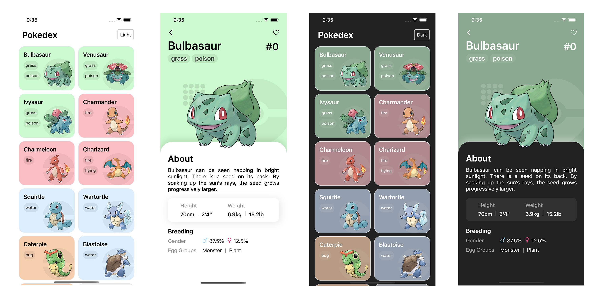

# Pokedex

An application that simply shows a number of Pokemons in a list and allows the user to see basic descriptions about the Pokemon such as name, species type, height, weight, gender, egg group.

Built using PokeAPI and React Native.

## Requirements

- Expo
- React Native
